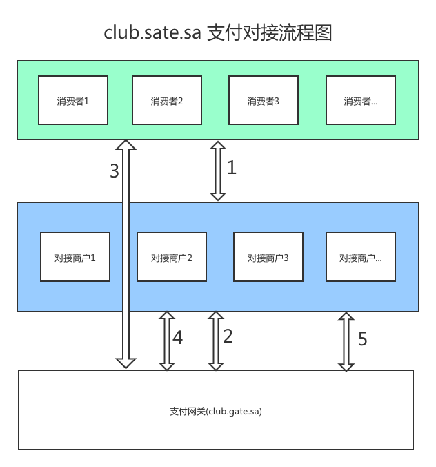

# 支付对接文档

## 重要的事情重复三遍之一
<pre>
本支付网关订单金额需要放到100倍，这么做是为了避免浮点数计算，比如收款1美元，需要传递 amount = 100
本支付网关订单金额需要放到100倍，这么做是为了避免浮点数计算，比如收款1美元，需要传递 amount = 100
本支付网关订单金额需要放到100倍，这么做是为了避免浮点数计算，比如收款1美元，需要传递 amount = 100
</pre>

<pre>名词解释</pre>
* `支付网关` 供支付服务, 用来让`对接商户`创建支付订单，让`消费者`完成支付操作
* `对接商户` 提供商品或者服务给`消费者`, 消费者支付的时候需要引导到`支付网关`的对应支付地址
* `消费者` 在`对接商户`页面购买商品或者服务，到`支付网关`完成支付操作

## 支付接口相关
<pre>支付网关api根路径</pre>
* https://club.sgate.sa/api_v1

<pre>支付网关提供的接口</pre>
* `接口1` [POST] /users/:userId/orders 对接商户创建订单
  * 接口请求参数 body schema 定义, 参考 附录2
  * 接口返回创建有的订单详情，参考 附录1

* `接口2` [GET] /orders/:orderId 对接商户，查看订单详情接口
  * 接口参数，仅需要 orderId 支付网关订单id，创建订单返回的 `id` 值
  * 接口返回创建有的订单详情，参考 附录1

## 订单状态种类
* `active` 订单已激活, 等待支付状态
* `paid` 订单已支付, 对接商家基于该状态来让自己的订单进入已付款，待发货状态
* `error` 订单失败，具体信息查看订单详情的 message 信息

## 支付网关提供的页面
* https://club.sgate.sa/ 支付页面
  * 参数 `orderId` 必填，支付网关创建订单返回的 `id`
  * 参数 `ticket` 必填, 支付网关创建订单返回的 `ticket`
  * 参数 `method` 选填, 页面方式 可选 `lightbox` or `paymentPage` 分别代表轻量级本页支付弹层以及全新页面支付
  * 参数 `returnURL` 选填，支付完成后返回页面url, 不传则无法跳回, 返回页面会额外携带三个参数 orderId, ticket, action, action: `complete` 支付成功，`error` 支付失败，`cancel` 支付取消

<pre>对接商家需要提供一个接受订单状态变更api</pre>
  * 就是 client 以及订单里的 notificationURL 参数指向的地址
  * 支付网关在订单完成支付后会通过该接口通知对接商户
  * 通过 GET 方式请求该接口
  * queryString 里会增加一个 `_orderId` 的参数，值等于订单的id
  * 同一个订单在支付完成后立刻会通知对接商户，之后三天内会最多通知100次
  * 直到商户的 notificationURL 接口成功返回 http 状态200 且内容是 `COMPLETED::{order.id}`
  * 商户收到通知后去再次调用订单详情去查询订单支付状态
  * 当读取到订单状态为 `paid` 代表支付成功，此时修改对接商户自己的订单状态为已支付
  * 注意这里要留意双花问题，避免利益受损
  * 切莫收到一次通知发一次货

## 重要的事情重复三遍之二
<pre>
切莫收到一次通知发一次货
切莫收到一次通知发一次货
切莫收到一次通知发一次货
</pre>

# 对接流程，结合下图，仔细看我的文档，注意图中标注的箭头序号

* 消费者在对接商家网站上下达购买订单，对应 `箭头1`
* 对接商家在接到消费者下单请求，也就是 `箭头1` 的请求，现在创建自己的订单，之后调用支付网关的 `接口1`(创建支付订单), 对应 `箭头2`
* 对接商家构造具体的支付页面，引导用户浏览器到支付页面, 对接 `箭头3`
* 支付网关页面引导用户支付，完成后跳回商户对应页面
* 支付成功后支付网关会通过服务器端通知对接商户 `箭头4`
* 对接商户收到通知后，再次向支付网关发起请求 `接口2`(查看订单详情) 确定支付状态, 对接 `箭头5`

# 其他事项
<pre>对接商家申请对接, 获取对接的必要信息</pre>
* `userId` int 商家ID
* `clientId` int 商家对接点的ID, 同一个商家可以有多个对接点, 以便能更好的关系自身不同的购物或服务站点
* `key` string 商家对接公钥 key
* `secret` string 商家对接私钥, 对接私钥 `secret` 切莫公开，注意别泄漏，推荐系统内 AES 加密存储，需要的时候解密

## 重要的事情重复三遍之三
<pre>
对接私钥 `secret` 切莫公开，注意保护，别泄漏, 推荐 AES 加密存储
对接私钥 `secret` 切莫公开，注意保护，别泄漏, 推荐 AES 加密存储
对接私钥 `secret` 切莫公开，注意保护，别泄漏, 推荐 AES 加密存储
</pre>

<pre>对接商户在请求支付网关接口的时候全部采用签名验证的方式</pre>
## 签名认证方式
* 构造请求参数的头信息, 签名验证所有信息均在头信息里
* 需要包含一下头信息
  * x-auth-signature 签名字符串
  * x-auth-key 申请签名授权拿到的 key
  * x-auth-timestamp 发起请求的时间戳 int32 秒级
  * x-auth-sign-method 签名计算方式目前统一为 HmacSHA256
  * x-auth-sign-version 前面计算方式版本目前统一为 1
* 签名计算方式
  * 整理一批键值对,变成 key=value 的格式。value要经过urlencode 处理,
  * 之后按照字典升序的方式排序这批键值对，之后用 & 符号链接
  * 之后再利用上面申请到的 secret 利用 sha256 来计算这个拼接后字符串的摘要信息, 输出为 `base64` 编码
  * 键值对如下
  <pre>
    uri: 请求的url去掉 root 的部分，例如: /users/100000/orders
    key: 申请到的key,
    timestamp: 时间戳, int32 秒级
    signMethod: "HmacSHA256" 固定
    signVersion: "1" 固定
    method: 'user.addOrder' 不同接口这个值不一样，创建订单: user.addOrder, 订单详情: order.detail
  </pre>

## STCPay 支付相关补充文档
<pre>支付流程(STCPay 支付无须跳转到 club.sgate.sa 支付页面)</pre>
* 调用接口创建支付订单
* 通过页面收集用户的支付短信验证码
* 调用订单完成接口，验证短信验证码
  * 成功 则支付完成
  * 失败 提示用户验证码错误

<pre> STCPay 支付用户输入支付短信验证码的必须在 5 分钟之内，超时需要重新创建支付订单</pre>

<pre>STCPay 支付短信验证码确认接口</pre>
* [PUT/PATCH] /orders/:orderId/complete 对接商户请求订单已支付完成验证
  * 接口请求参数 body schema 定义, 参考 附录3
  * 接口返回订单详情，参考 附录1

## wireTransfer 支付相关补充文档
<pre>支付流程(wireTransfer 支付必须跳转到 https://club.sgate.sa/wire-transfer/ 支付页面)</pre>
* https://club.sgate.sa/wire-transfer/ 支付页面
  * 参数 `orderId` 必填，支付网关创建订单返回的 `id`
  * 参数 `ticket` 必填, 支付网关创建订单返回的 `ticket`
  * 参数 `method` 选填, 页面方式 可选 `lightbox` or `paymentPage` 分别代表轻量级本页支付弹层以及全新页面支付
  * 参数 `returnURL` 选填，支付完成后返回页面url, 不传则无法跳回, 返回页面会额外携带三个参数 orderId, ticket, action, action: `complete` 支付成功，`error` 支付失败，`cancel` 支付取消, `contact` 显示商户的客服联系人页面

## 附录1
* 订单详情 schema 定义
<pre>
{
  "description": "创建订单接口返回信息",
  "type": "object",
  "properties": {
    "id": {
      "description": "支付网关订单ID, 查询订单详情，跳转支付地址均需要改ID",
      "type": "string",
      "minLength": 20,
      "maxLength": 40,
    },
    "name": {
      "description": "订单备注信息，方便管理人员核对信息, 来源于订单创建的 name 参数",
      "type": "string",
    },
    "userId": {
      "description": "对接商户的ID, 来源于订单创建路径里的 :userId",
      "type": "integer",
    },
    "userOrderId": {
      "description": "对接商户订单ID, 来源于订单创建参数里的 userOrderId",
      "type": "integer",
    },
    "currency": {
      "description": "支付货币种类，来源于订单创建参数里的 currency",
      "type": "string",
    },
    "amount": {
      "description": "支付货币金额，来源于订单创建参数里的 amount",
      "type": "integer",
    },
    "status": {
      "description": "订单状态，新创建的订单为 `active`,
      "type": "string",
    },
    "ticket": {
      "description": "支付票据，随机生成64位随机字符创，用来保障非登录访客支付的安全，以及订单的安全",
      "type": "string",
    },
    "paidAt": {
      "description": "订单完成支付的时间",
      "type": "string",
      "format": "date-time",
    },
    "gate": {
      "description": "支付网关选择",
      "type": "string",
      "enum": ["mastercard"],
    },
    "notificationURL": {
      "description": "订单通知接口地址, 来源于订单创建时的 notificationURL 参数",
      "type": "string",
      "format": "url"
    }
  }
}
</pre>

## 附录2
* 创建订单接口请求 参数
<pre>
{
  "description": "对接商户创建支付订单",
  "type": "object",
  "required": ["name", "userId", "clientId", "userOrderId", "gate", "currency", "amount"],
  "additionalProperties": false,
  "properties": {
    "clientId": {
      "description": "所属 clientId",
      "type": "integer"
    },
    "userId": {
      "description": "所属用户 ID",
      "type": "integer"
    },
    "name": {
      "description": "备注信息",
      "type": "string",
      "minLength": 1,
      "maxLength": 120
    },
    "gate": {
      "description": "支付网关选择",
      "type": "string",
      "enum": ["mastercard", "stcpay"]
    },
    "userOrderId": {
      "description": "商户系统订单ID，商户要保证该值唯一性",
      "type": "string",
      "minLength": 1,
      "maxLength": 60
    },
    "mobile": {
      "description": "stcpay 支付者手机号码",
      "type": "string",
      "minLength": 4,
      "maxLength": 20
    },
    "currency": {
      "description": "订单金额币种",
      "type": "string",
      "enum": ["SAR"]
    },
    "amount": {
      "description": "订单金额，为避免浮点数运算问题，统一放大100倍, 取整",
      "type": "integer"
    },
    "notificationURL": {
      "description": "订单状态变更回调地址",
      "type": "string",
      "format": "url"
    }
  }
}
</pre>

## 附录3
* 订单支付完成验证接口参数
<pre>
{
  "description": "支付页面回调设置订单为已支付",
  "required": ["orderId", "ticket", "info"],
  "properties": {
    "orderId": {
      "description": "订单ID",
      "type": "string"
    },
    "ticket": {
      "description": "订单票据",
      "type": "string"
    },
    "info": {
      "description": "必要的确认信息",
      "type": "object",
      "required": ["OtpValue"],
      "properties": {
        "OtpValue": {
          "description": "stcpay 支付验证信息",
          "type": "string"
        }
      }
    }
  }
}
</pre>

## 常见问题 Q&A
* Q: 服务器请求平台接口报证书错误 Unable to verify the first certificate
<pre>
A: 客户端需要下载证书并在请求的时候指定证书
参考文档地址: https://zhuanlan.zhihu.com/p/108958388

curl --output intermediate.crt http://crt.sectigo.com/SectigoRSADomainValidationSecureServerCA.crt
openssl x509 -inform DER -in intermediate.crt -out intermediate.pem -text

执行这两条命令，之后会生成一个 intermediate.pem 文件，请求的时候指定一下这个证书文件就可以了。
</pre>
